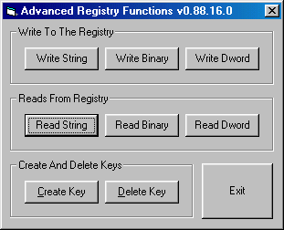



## Advanced Registry Functions

### Description

This gives you control over the windows registry

all neede registry functions included

even this has KeyExist and KeyValuExist function

heavily commneted even a kid would understand whats going on
 
### More Info
 

             |
---                |---
**Submitted On**   |2004-10-05 19:50:24
**By**             |[Nymph Technologies](https://github.com/Planet-Source-Code/PSCIndex/blob/master/ByAuthor/nymph-technologies.md)
**Level**          |Advanced
**User Rating**    |4.8 (24 globes from 5 users)
**Compatibility**  |VB 5\.0, VB 6\.0, VB Script
**Category**       |[Registry](https://github.com/Planet-Source-Code/PSCIndex/blob/master/ByCategory/registry__1-36.md)
**World**          |[Visual Basic](https://github.com/Planet-Source-Code/PSCIndex/blob/master/ByWorld/visual-basic.md)
**Archive File**   |[Advanced\_R1801611062004\.zip](https://github.com/Planet-Source-Code/nymph-technologies-advanced-registry-functions__1-56557/archive/master.zip)

